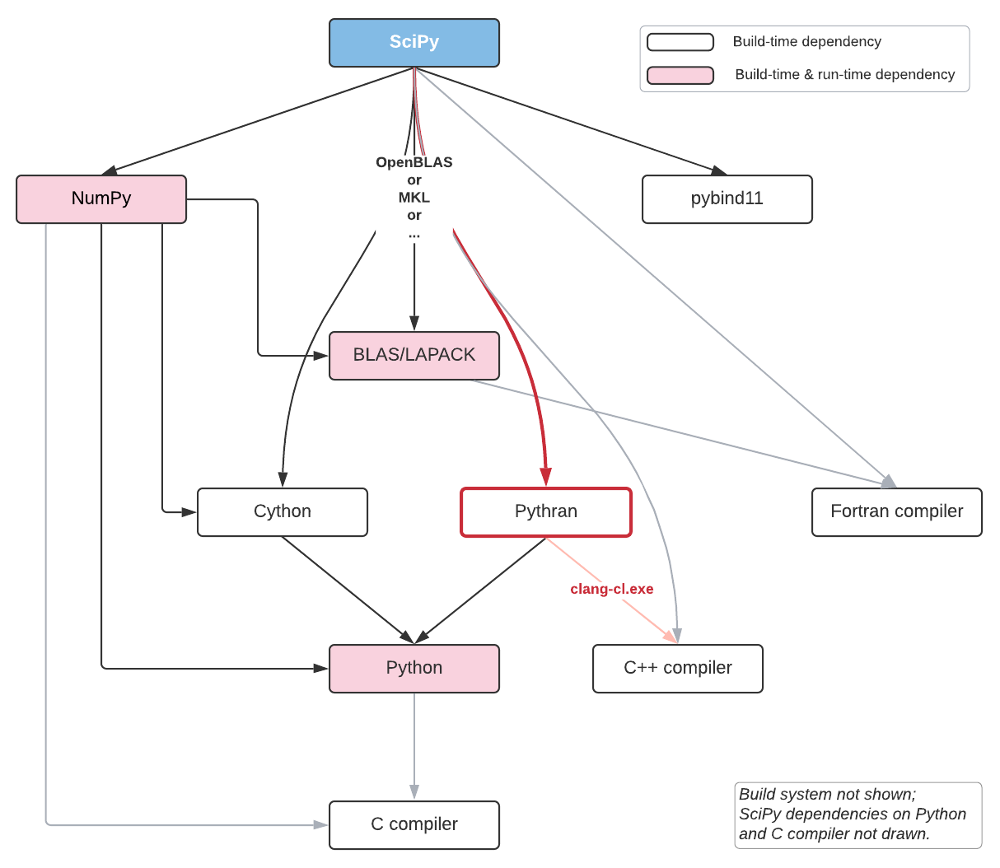

:title: Building SciPy Kernels with Pythran
:data-transition-duration: 150
:skip-help: true
:slide-numbers: true
:css: font.css

Intro
=====

SciPy & Pythran

Ralf Gommers & Serge Guelton

----

A packager's choice
===================

::

    >>> performant library
    <<< easy to deploy

    --- native code
    +++ compatible with PyPI

----

How SciPy is Built
==================

..
  RG: I want to talk here about build-time vs. runtime dependencies. It depends
  on where you are in the stack. The lower you go, the more you want to avoid
  runtime dependencies. On the other hand, if you go up in the stack to
  packages that do not yet have build-time dependencies, adding Pythran (or
  Cython) is very costly - that is where Numba makes sense (e.g. ship a single
  pure Python wheel vs. needing to ship ~20).

----

How SciPy is Written
====================

- ``.py``: for the glue, and non critical parts
- ``.pyx``: for critical parts
- ``.f77``: for very old critical parts
- ``.c`` /``.cpp``: for ultra critical parts :-)

----

Lower the Maintenance Cost
==========================

Looking for a tool which:

- takes pure Python code as input
- understands NumPy high-level constructs
- delivers performance
- without (m)any runtime dependencies

----

Isn't Cython Enough?
====================

Cython is a **great** tool

- incremental conversion / mixed mode
- great for gluing existing native code/library with Python
- good portability, no runtime requirements

- but still has a non-negligible learning curve
- tends to be closer to C than Python when performance matters

----

What About Numba Then?
======================

Numba is a **great** tool

- Just-in-Time compilation
- GPU support
- Pure Python syntax

- but it has more runtime dependencies
- tends to require lower-level programming

..
  @SG we should mention Numba. How about reusing the table from
  https://fluiddyn.netlify.app/transonic-vision.html#Overall-comparison-between-Cython,-Numba-and-Pythran
  ?
  @RG: I added a section on numba, and I'm fine to reuse that table as a
  concluding slide on these aspects

----

The Pythran Approach
====================

Keep input code portable and high-level

- Pure Python
- Using NumPy idioms

But still

- Efficient explicit looping

----

A Typical SciPy Kernel
======================

    #pythran export _max_len_seq_inner(intp[], int8[], int, int, int8[])

.. code:: python

    import numpy as np
    def _max_len_seq_inner(taps, state, nbits, length, seq):
        n_taps = taps.shape[0]
        idx = 0
        for i in range(length):
            feedback = state[idx]
            seq[i] = feedback
            for ti in range(n_taps):
                feedback ^= state[(taps[ti] + idx) % nbits]
            state[idx] = feedback
            idx = (idx + 1) % nbits
        return np.roll(state, -idx, axis=0)

----

Anatomy of a SciPy Kernel
=========================

- Uses NumPy: ``import numpy as np``
- Explicit looping: ``for i in range(length):``
- Explicit indexing: ``state[(taps[ti] + idx) % nbits]``
- High-Level idiom: ``np.roll(state, -idx, axis=0)``

⇒ Interleaving low-level and high-level abstractions

----

Pythran Conversion
==================

.. code:: shell

    $ sed -i -e '1 i #pythran export _max_len_seq_inner(intp[], int8[], int, int, int8[])' kernel.py
    $ pythran kernel.py

----

Notebook Playground
===================

.. code:: python

    %%pythran
    #pythran export _max_len_seq_inner(intp[], int8[], int, int, int8[])
    def _max_len_seq_inner(taps, state, nbits, length, seq):
        n_taps = taps.shape[0]
        # ...
        return np.roll(state, -idx, axis=0)

----

Distutils Playground
====================

.. code:: python

    from distutils.core import setup

    # These two lines are required to be able to use pythran in the setup.py
    import setuptools
    setuptools.dist.Distribution(dict(setup_requires='pythran'))

    from pythran.dist import PythranExtension, PythranBuildExt
    setup(...,
          ext_modules=[PythranExtension("mymodule", ["mymodule.py"])],
          cmdclass={"build_ext": PythranBuildExt})

..
  RG: if we leave this in, I will want to mention Meson:)

----

Benefits for SciPy
==================

Key benefit: **easiest way to write fast kernels**

- Developer experience almost as good as with Numba, accessible to almost every
  contributor
- It's fast (typically >= Cython, even without SIMD)
- Produced binaries are much smaller than those from Cython
- Pythran itself is easy to contribute to, and has responsive maintainer
- Build system integration is easy(-ish)

----

Current Usage in SciPy
======================

- Largest extension: `RBFInterpolator`
- Several small extensions:

  .. code-block:: shell

    $ git grep -l  '#pythran'
    scipy/optimize/_group_columns.py
    scipy/signal/_max_len_seq_inner.py
    scipy/signal/_spectral.py
    scipy/stats/_hypotests_pythran.py

- More PRs in progress.

----

Limitation wrt. SciPy
=====================

Still gaps in functionality - not all of NumPy covered:

- `numpy.random`
- APIs with too much "dynamic" behavior
- Can only support regular numerical dtypes (so no `object`)
- There is no "escape hatch" - if something is not supported, it must be
  implemented in Pythran itself first
- No threading - OpenMP is forbidden in SciPy (see https://github.com/scipy/scipy/pull/13576, went with Cython there)
- Portability TBD - waiting for more feedback on exotic platforms (:wave: Debian)
- Extra constraint on Windows: must build with ``clang-cl``

----

Integration Status
==================

Currently Pythran is:

- **enabled** by default in the SciPy build
- still an **optional** dependency (to disable: ``export SCIPY_USE_PYTHRAN=0``)

Lessons from the recent SciPy ``1.7.0`` release:

- Portability issues on AIX
- Status with PyPy unclear (PyPy has other issues that need resolving first)
- Other than that, mostly smooth sailing

Note:

- Several Pythran releases were needed to fix distutils integration
  - native code + multiple platform = <3

----

GSoC Student: Xingyu-Liu
------------------------

Crawling in SciPy's code base, looking for kernel to benchmark and convert

Read the log of her journey:

https://blogs.python-gsoc.org/en/xingyu-lius-blog/

----

Discussion
==========

- compiling with ``-DUSE_XSIMD -march=native`` for auto-vectorization at the
  expense of portability

- compiling with ``-fopenmp`` and adding openmp annotation at the expense of
  portability (again)

- Linux, Windows and macOS portability

----

Conclusion
==========

Let's pretend we're smart

- Pythran will likely become a hard build dependency for or after SciPy 1.8.0
- SciPy contributors like Pythran
- Question: can we somehow combine it with CuPy's Python-to-CUDA JIT
  transpiler? It emits C++ code too, so we could get fast CPU + GPU code like
  that.

.. SG: that's a bold move ;-)
